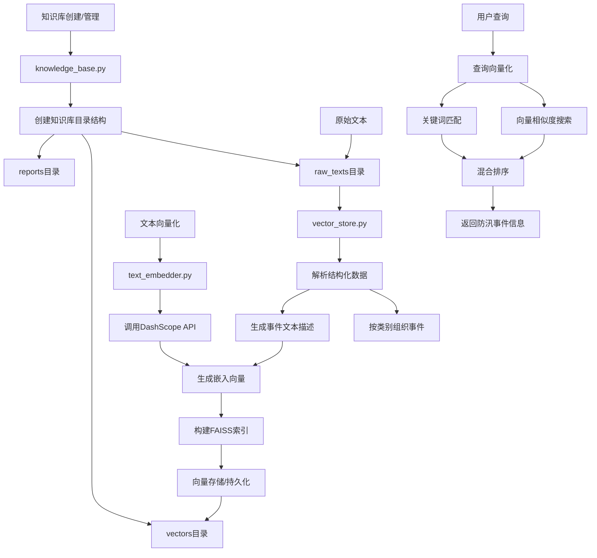

# RAG知识管理模块实现报告

## 1. 模块概述

知识管理模块是本防汛信息系统RAG架构的核心组件，负责处理结构化知识的存储、向量化和检索功能。该模块实现了基于向量的语义搜索与基于关键词的精确匹配相结合的混合检索策略，为系统提供强大的知识检索能力。

本模块由三个主要组件构成：
- `knowledge_base.py`: 知识库管理，提供知识库的增删改查功能
- `text_embedder.py`: 文本向量化，将文本内容转换为语义向量
- `vector_store.py`: 向量存储和检索，实现高效的混合搜索功能




## 2. 模块详解

### 2.1 knowledge_base.py - 知识库管理

知识库管理组件负责系统中知识库的创建、查询、更新和删除等基本操作。每个知识库都拥有唯一ID并包含相应的元数据信息。

#### 核心功能

1. **知识库管理**：
   - 创建新知识库：生成唯一ID，创建目录结构，保存元数据
   - 查询知识库：获取现有知识库列表或特定知识库的信息
   - 更新知识库：修改知识库的名称、描述等信息
   - 删除知识库：移除知识库及其所有关联数据

2. **目录结构管理**：
   - 为每个知识库创建标准化的目录结构
   - 每个知识库包含三个子目录：`raw_texts`（原始文本）、`vectors`（向量数据）、`reports`（报告）

#### 关键实现

```python
def create(self, name: str, description: str = "") -> Dict:
    """创建新的知识库"""
    # 基于当前时间创建唯一ID
    kb_id = f"kb_{datetime.now().strftime('%Y%m%d%H%M%S')}"
    # 创建知识库目录及子目录
    kb_dir = os.path.join(self.base_dir, kb_id)
    os.makedirs(kb_dir)
    os.makedirs(os.path.join(kb_dir, "raw_texts"), exist_ok=True)
    os.makedirs(os.path.join(kb_dir, "vectors"), exist_ok=True)
    os.makedirs(os.path.join(kb_dir, "reports"), exist_ok=True)
    # 保存知识库信息
    kb_info = {...}  # 知识库元数据
    self._save_info(kb_id, kb_info)
    return kb_info
```

### 2.2 text_embedder.py - 文本向量化

文本向量化组件负责将文本转换为高维向量表示，是连接语义理解与向量检索的关键环节。该组件使用火山引擎DashScope的文本嵌入服务，将文本映射到高维向量空间。

#### 核心功能

1. **文本向量化**：
   - 将单个文本或文本列表转换为向量表示
   - 处理超长文本，确保满足模型输入限制
   - 错误处理和日志记录

2. **模型服务集成**：
   - 集成火山引擎DashScope的文本嵌入API
   - 管理API密钥和服务调用

#### 关键实现

```python
def embed_text(self, texts):
    """生成文本的向量表示"""
    # 确保输入是列表格式
    if not isinstance(texts, list):
        texts = [texts]
    
    # 长度限制处理
    for i, text in enumerate(texts):
        if len(text) > 2048:  # 模型输入限制
            texts[i] = text[:2048]
    
    # 调用API生成向量
    response = dashscope.TextEmbedding.call(
        model=self.model_name,
        input=texts
    )
    
    # 处理结果
    if response.status_code == HTTPStatus.OK:
        embeddings = [item['embedding'] for item in response.output['embeddings']]
        return embeddings
    # 错误处理...
```

### 2.3 vector_store.py - 向量存储和检索

向量存储和检索组件是整个RAG系统的核心，负责管理向量索引和实现高效的混合搜索功能。该组件使用FAISS作为底层向量搜索引擎，同时结合关键词匹配策略，提供精准的信息检索能力。

#### 核心功能

1. **数据加载与解析**：
   - 从文本文件加载结构化数据
   - 解析各类防汛事件信息
   - 生成用于向量化的事件文本描述

2. **向量索引管理**：
   - 构建FAISS向量索引
   - 保存和加载索引文件
   - 增量添加新数据到现有索引

3. **混合搜索策略**：
   - 向量相似度搜索：基于语义相似性
   - 关键词匹配：基于词频统计
   - 加权混合结果：结合两种搜索策略

4. **分词和文本处理**：
   - 使用jieba进行中文分词
   - 停用词过滤
   - 关键词匹配得分计算

#### 关键实现

```python
def search(self, query: str, category: str = None, k: int = 5, alpha: float = 0.7):
    """混合搜索：结合向量相似度和关键词匹配"""
    # 1. 向量相似度搜索
    query_vector = self.embedder.embed_text([query])
    distances, indices = self.index.search(np.array(query_vector), k * 2)
    
    # 2. 关键词匹配
    query_tokens = self._tokenize(query)
    
    results = []
    for j, i in enumerate(indices[0]):
        # 检查索引有效性及类别过滤
        if i != -1 and i < len(self.event_texts):
            metadata = self.event_metadata[i]
            if category is None or metadata["category"] == category:
                # 获取文档内容及元数据
                event = self.events[metadata["category"]][...]
                
                # 计算关键词匹配得分
                doc_tokens = self._tokenize(self.event_texts[i])
                keyword_score = self._calculate_keyword_score(query_tokens, doc_tokens)
                
                # 归一化向量距离得分
                vector_score = 1.0 / (1.0 + float(distances[0][j]))
                
                # 计算综合得分：向量相似度和关键词匹配的加权组合
                final_score = alpha * vector_score + (1 - alpha) * keyword_score
                
                results.append({
                    "category": metadata["category"],
                    "event": event,
                    "distance": float(distances[0][j]),
                    "keyword_score": keyword_score,
                    "final_score": final_score
                })
    
    # 按综合得分排序
    sorted_results = sorted(results, key=lambda x: x["final_score"], reverse=True)
    return sorted_results[:k]
```

## 3. 工作流程

RAG知识管理模块的完整工作流程包括数据准备、向量化和检索三个主要阶段：

### 3.1 数据准备阶段

1. 创建知识库并建立目录结构
2. 爬虫模块抓取并解析防汛相关信息，保存到知识库的`raw_texts`目录
3. 加载文本文件，解析结构化数据
4. 事件数据按类别（降雨、水情、灾情、措施）组织
5. 生成用于向量化的事件文本描述

### 3.2 向量化阶段

1. 使用文本嵌入模型将事件文本转换为向量表示
2. 构建FAISS向量索引
3. 保存索引和元数据到`vectors`目录
4. 在系统启动时加载预构建的索引，避免重复计算

### 3.3 检索阶段

1. 接收用户查询
2. 将查询文本转换为向量表示
3. 使用FAISS进行向量相似度搜索，获取候选结果
4. 对候选结果进行关键词匹配
5. 计算综合得分并排序
6. 返回最相关的防汛事件信息

## 4. 技术特点

### 4.1 混合检索策略

该模块采用向量相似度和关键词匹配相结合的混合检索策略，充分发挥两种方法的优势：

1. **向量相似度**：
   - 优势：捕获深层语义关系，处理同义表达和隐含关系
   - 案例：对于"湖南暴雨灾情"查询，可以匹配包含"湘江流域降水导致洪涝"的文档，即使关键词不完全匹配

2. **关键词匹配**：
   - 优势：确保关键术语的精确匹配，提高结果的精确性
   - 案例：确保包含"2023年7月"或"38.5米水位"等具体数值信息的精确匹配

3. **加权组合**：
   - 通过`alpha`参数控制两种策略的权重
   - 默认权重为向量相似度0.7，关键词匹配0.3
   - 系统可根据实际需求调整该参数

### 4.2 效率优化

1. **索引持久化**：
   - 向量索引构建后保存到磁盘
   - 系统启动时直接加载预构建索引，避免重复计算
   - 大幅减少系统冷启动时间

2. **增量更新**：
   - 支持不重建索引的情况下添加新数据
   - 适合实时更新的场景

3. **FAISS优化**：
   - 使用L2距离度量的平面索引
   - 适合中小规模数据集的精确检索

### 4.3 灵活扩展

1. **类别过滤**：
   - 支持按事件类别（降雨、水情、灾情、措施）过滤搜索结果
   - 提高检索结果的相关性

2. **可调参数**：
   - 结果数量(k)：控制返回的结果数量
   - 权重系数(alpha)：调整向量相似度和关键词匹配的权重
   - 允许根据不同应用场景调整这些参数

3. **分词优化**：
   - 使用jieba进行中文分词
   - 自定义停用词列表，提高关键词匹配质量

## 5. 应用场景

RAG知识管理模块在防汛信息系统中有多种应用场景：

1. **防汛信息检索**：
   - 查询特定地区的降雨情况
   - 检索水位超警戒线的河段
   - 查找受灾情况和灾情统计
   - 检索防汛应对措施和成功案例

2. **多模态融合**：
   - 结合文本、图像和视频信息
   - 通过向量化将多模态内容统一到同一语义空间

3. **实时防汛决策支持**：
   - 快速查找历史类似案例
   - 检索应对特定灾情的最佳措施

4. **情报分析**：
   - 汇总多源防汛信息
   - 建立关联分析和趋势预测

## 6. 挑战与解决方案

在实现过程中，遇到了以下挑战及其解决方案：

### 6.1 数据质量参差不齐

**挑战**：爬虫抓取的原始数据质量不一，格式不统一，有些数据缺失关键字段。

**解决方案**：
- 实现了健壮的数据解析逻辑，处理各种格式和缺失情况
- 对数据进行标准化处理，补充默认值和类别信息
- 记录详细日志，便于排查和改进

### 6.2 检索质量优化

**挑战**：单纯依赖向量相似度或关键词匹配都无法获得最佳结果。

**解决方案**：
- 实现混合检索策略，结合两种方法的优势
- 引入可调节的权重参数，允许根据需求调整
- 使用专门的中文分词和停用词列表优化中文检索

### 6.3 系统性能与扩展性

**挑战**：随着数据量增长，系统性能和资源消耗成为关注点。

**解决方案**：
- 实现索引持久化和增量更新，避免频繁重建索引
- 优化FAISS索引配置，平衡精度和性能
- 设计模块化架构，便于未来扩展（如支持更多索引类型）

## 7. 未来改进方向

以下是该模块未来可能的改进方向：

1. **高级索引结构**：
   - 实现分层索引或量化索引，提高大规模数据集的搜索效率
   - 探索图索引，更好地表达事件之间的关系

2. **预训练与微调**：
   - 针对防汛领域数据微调文本嵌入模型
   - 提高特定领域术语和概念的表示质量

3. **时空索引**：
   - 增强时间和地理位置的索引能力
   - 支持基于时间范围和地理区域的精确查询

4. **知识图谱集成**：
   - 将向量搜索与知识图谱相结合
   - 提供更丰富的语义关联和推理能力

5. **用户反馈优化**：
   - 收集用户反馈，自动调整搜索参数
   - 实现个性化搜索体验

## 8. 结论

RAG知识管理模块是防汛信息系统的核心组件，通过知识库管理、文本向量化和混合检索策略，为系统提供了强大的知识检索能力。该模块采用现代向量数据库技术和混合搜索策略，实现了高效、精准的防汛知识检索功能。

该模块的设计遵循模块化和可扩展性原则，为系统未来的功能扩展和性能优化预留了空间。通过持续改进和优化，该模块将能够应对更大规模的数据和更复杂的检索需求，为防汛决策提供更加强大的支持。
