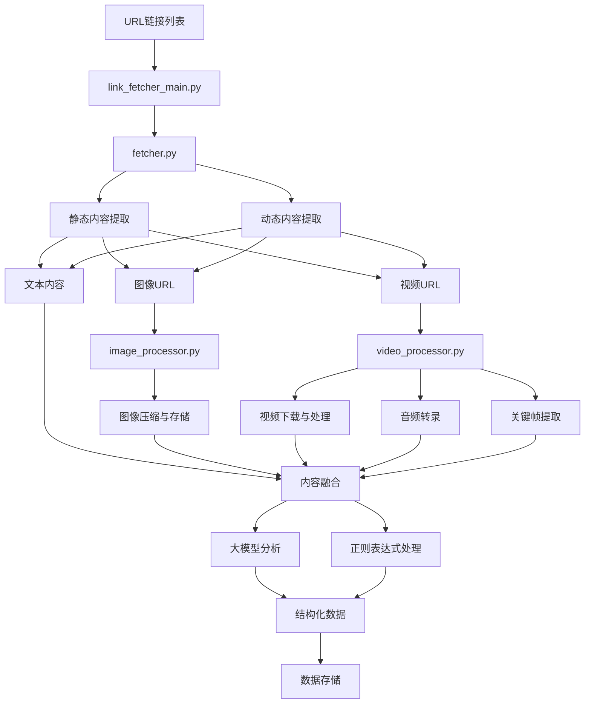

# 防汛信息爬虫系统实现报告

## 1. 系统概述

防汛信息爬虫系统是一个多模态数据采集和处理系统，旨在从各种网络来源自动提取防汛相关信息，并将其结构化，便于后续分析和应用。该系统能够处理文本、图像和视频多种媒体类型，并通过正则表达式和大语言模型相结合的方式，精确提取防汛信息中的关键数据，如降雨量、水位、灾情和应对措施等。

本系统由四个主要模块组成：
- `fetcher.py`: 负责网页内容提取
- `image_processor.py`: 负责图像处理和存储
- `video_processor.py`: 负责视频下载、处理和分析
- `link_fetcher_main.py`: 主模块，集成上述功能并提取结构化数据

## 2. 系统架构

系统采用模块化设计，各组件职责明确，工作流程如下：

1. **链接输入处理**：系统接收URL列表作为输入
2. **内容提取**：对每个URL进行静态和动态内容提取
3. **多模态处理**：分别处理文本、图像和视频内容
4. **结构化信息提取**：使用大模型和正则表达式提取防汛相关结构化数据
5. **数据存储**：将提取的结构化数据保存到指定目录





## 3. 模块详解

### 3.1 fetcher.py - 网页内容提取模块

该模块负责从URL中提取文本、图像和视频内容，具有以下特点：

1. **双重提取策略**：
   - 静态提取：使用 requests 和 BeautifulSoup 进行初步内容提取
   - 动态提取：使用 Selenium 处理需要JavaScript渲染的内容和懒加载资源

2. **自适应内容识别**：
   - 针对不同网站（如腾讯新闻、微博等）使用特定选择器
   - 使用通用内容识别策略作为兜底方案

3. **媒体资源提取**：
   - 提取多种格式的图像URL
   - 识别各种视频平台的嵌入内容（如B站、YouTube等）

4. **跨浏览器支持**：
   - 支持Chrome和Edge浏览器驱动
   - 使用无头模式提高效率

关键实现：
```python
def fetch_content(url):
    """从URL提取文本和媒体信息"""
    # 静态提取
    response = requests.get(url, headers=headers, timeout=10)
    soup = BeautifulSoup(response.text, 'html.parser')
    
    # 提取文本、图片、视频
    result['text'] = extract_text(soup)
    result['image_urls'] = extract_images(soup)
    result['video_urls'] = extract_video_urls(url, soup)
    
    # 动态提取补充内容
    dynamic_result = _fetch_dynamic_content(url, soup, result)
    
    return merged_results
```

### 3.2 image_processor.py - 图像处理模块

该模块负责处理提取到的图像，主要功能包括：

1. **图像压缩**：
   - 智能调整图像质量，控制文件大小
   - 保持图像信息的同时优化存储空间

2. **云存储集成**：
   - 集成火山引擎对象存储服务(TOS)
   - 生成唯一的对象键保存图像
   - 创建临时访问URL供后续处理使用

3. **批量图像处理**：
   - 并行处理多张图像
   - 错误处理和日志记录

关键实现：
```python
def compress_image(image_data, target_size=300 * 1024):
    """压缩图像到目标大小"""
    img = Image.open(BytesIO(image_data))
    # 根据目标大小计算压缩质量
    image_quality = calculate_quality(image_data, target_size)
    # 迭代压缩直到满足目标大小
    return compressed_data

def upload_image(image_data, object_key_prefix):
    """上传图像到对象存储并返回预签名URL"""
    unique_key = generate_unique_key(object_key_prefix)
    # 上传到TOS并生成预签名URL
    return pre_signed_url
```

### 3.3 video_processor.py - 视频处理模块

该模块专门处理视频内容，具有以下功能：

1. **视频下载**：
   - 使用yt-dlp工具下载各种平台的视频
   - 支持主流视频网站如B站、YouTube等

2. **多模态信息提取**：
   - **音频处理**：从视频中提取音频并转录为文本
   - **关键帧提取**：按一定时间间隔提取关键帧
   - **内容理解**：使用大模型分析视频帧内容

3. **资源优化**：
   - 截取长视频的前几分钟减少处理时间
   - 清理临时文件

关键实现：
```python
def process_video(video_url, object_key_prefix, client):
    """全面处理视频内容"""
    # 下载视频和提取音频
    video_file, audio_file = download_video(video_url, video_id)
    
    # 音频转录
    transcription = transcribe_audio(audio_file)
    
    # 提取视频帧并分析
    frames = extract_video_frames(video_file)
    frame_urls = process_frames(frames, object_key_prefix)
    
    # 使用大模型分析视频内容
    video_description = analyze_frames(frame_urls, client)
    
    return [transcription, video_description]
```

### 3.4 link_fetcher_main.py - 主处理模块

该模块是系统的核心，整合其他模块功能，实现完整的信息提取流程：

1. **链接批量处理**：
   - 支持处理多个链接
   - 提供进度回调机制

2. **多模态内容融合**：
   - 将文本、图像描述和视频转录内容合并
   - 为大模型分析提供全面的上下文

3. **结构化数据提取**：
   - 使用大语言模型提取防汛相关结构化信息
   - 使用正则表达式校验和补充大模型结果
   - 分类提取降雨信息、水情信息、灾情信息和应对措施

4. **数据存储**：
   - 按知识库结构保存提取结果
   - 生成规范化的文件名

关键实现：
```python
def fetch_and_understand_link(url):
    """从链接提取结构化防汛信息"""
    # 获取原始内容
    content = fetch_content(url)
    
    # 处理图像和视频
    image_descriptions = process_images(content['image_urls'])
    video_transcriptions = process_video(content['video_urls'])
    
    # 合并多模态内容
    combined_content = merge_contents(content, image_descriptions, video_transcriptions)
    
    # 使用大模型提取结构化信息
    structured_data = extract_structured_data(combined_content)
    
    # 使用正则表达式补充和校正数据
    enhanced_data = enhance_with_regex(structured_data, combined_content)
    
    return final_result
```

## 4. 关键技术

系统采用了多种先进技术，确保信息提取的精确性和全面性：

1. **Selenium与BeautifulSoup结合**：
   - 静态内容初步提取
   - 动态内容深度挖掘
   - 处理懒加载和JavaScript渲染内容

2. **多模态内容处理**：
   - 文本处理：使用正则表达式和自然语言处理
   - 图像处理：使用PIL库进行压缩和格式转换
   - 视频处理：使用OpenCV提取帧，Whisper转录音频

3. **大模型与规则结合**：
   - 使用火山引擎Ark大模型理解内容
   - 使用正则表达式补充和校验结果
   - 结合两种方式的优势，提高提取准确性

4. **云存储集成**：
   - 使用火山引擎TOS存储媒体文件
   - 生成预签名URL供后续分析使用

## 5. 数据结构

系统提取的结构化数据分为四大类：

1. **降雨信息 (rainfall)**：
   - 时间：记录降雨发生的具体时间
   - 地点：记录降雨的地理位置
   - 降雨量：具体的降雨量数值（毫米）
   - 描述：相关描述信息

2. **水情信息 (water_condition)**：
   - 时间：水情观测时间
   - 地点：河流、湖泊、水库等位置
   - 水位：具体水位高度（米）
   - 流量：水流流量（立方米/秒）
   - 描述：水情相关描述

3. **灾情信息 (disaster_impact)**：
   - 时间：灾情发生或统计时间
   - 地点：受灾地区
   - 受灾面积：受灾面积数值（万亩/公顷）
   - 受灾人口：受灾人数（万人）
   - 经济损失：损失金额（亿元/万元）
   - 描述：灾情详细描述

4. **应对措施 (measures)**：
   - 时间：措施实施时间
   - 地点：措施实施地点
   - 描述：具体措施内容

示例数据：
```json
{
  "rainfall": [
    {"time": "2023年7月15日", "location": "湖南长沙", "value": "154毫米", "description": "特大暴雨，日降雨量154毫米"}
  ],
  "water_condition": [
    {"time": "2023年7月16日", "location": "湘江长沙段", "water_level": "38.5米", "flow_rate": "12000立方米/秒", "description": "超警戒水位3.2米"}
  ],
  "disaster_impact": [
    {"time": "2023年7月20日", "location": "湖南省", "affected_area": "2.3万亩", "population": "1.5万人", "economic_loss": "1.2亿元", "description": "农田淹没，部分民房倒塌"}
  ],
  "measures": [
    {"time": "2023年7月15日", "location": "长沙市", "description": "启动防汛Ⅱ级应急响应，转移群众5000人"}
  ]
}
```

## 6. 挑战与解决方案

开发过程中遇到以下挑战及解决方案：

1. **多样化网页结构**：
   - 挑战：不同网站有不同的HTML结构和内容组织方式
   - 解决方案：采用先特殊后通用的策略，针对特定网站使用定制选择器，其他网站使用通用选择器

2. **视频处理效率**：
   - 挑战：视频文件大、处理耗时长
   - 解决方案：只处理视频前几分钟，提取关键帧而非全部帧，使用GPU加速转录

3. **结构化数据质量**：
   - 挑战：大模型提取的数据可能不完整或不准确
   - 解决方案：结合正则表达式进行补充和校验，构建默认结构兜底

4. **异常处理与恢复**：
   - 挑战：网络不稳定、内容无法访问等问题
   - 解决方案：完善的异常处理和日志记录，确保单个链接失败不影响整体处理

## 7. 未来改进方向

系统仍有以下改进空间：

1. **并行处理**：
   - 实现多线程或异步处理，提高批量链接处理效率

2. **增强模型容灾**：
   - 增加模型调用重试机制
   - 支持多种大模型API，实现故障转移

3. **数据质量优化**：
   - 增加更多专业领域的正则表达式模式
   - 引入专家知识图谱辅助验证

4. **Web界面**：
   - 开发图形化界面，支持任务监控和结果可视化

## 8. 结论

防汛信息爬虫系统通过融合网页爬虫、多模态处理和大模型分析技术，实现了从互联网自动提取防汛相关结构化数据的能力。系统设计模块化，易于扩展和维护，可适应多种数据源和防汛信息类型。

该系统对于快速收集、分析防汛信息，辅助防汛决策具有重要价值。通过持续改进和优化，系统将进一步提高信息提取的准确性、全面性和效率。 